# Pi NAS
This project is to create a Raspberry Pi NAS (Network-Attatched-Storage)

## Hardware Required 
- Raspberry Pi 4*
- Raspberry Pi Power Supply*
- Micro SD Card*^
- [SSD](https://www.amazon.com/SanDisk-1TB-Extreme-Portable-SDSSDE61-1T00-G25/dp/B08GTYFC37/ref=sxin_11_ac_d_mf_rm?ac_md=5-2-c2FuZGlzayBzc2Q%3D-ac_d_rm&crid=306F5O2S0ZSCU&cv_ct_cx=ssd&dchild=1&keywords=ssd&pd_rd_i=B08GTYFC37&pd_rd_r=047499d1-3c77-4291-b849-8163b14cbe8f&pd_rd_w=Qdg9p&pd_rd_wg=JYWC5&pf_rd_p=3a0458f0-bb4b-4875-9ade-bd49638aa842&pf_rd_r=D2EZV9TR7F6XZRX8BGD2&psc=1&qid=1616518421&sprefix=ssd%2Caps%2C212&sr=1-3-849f3c3a-785c-4812-aab6-3d7cb06022f2)
- [Ethernet Cable](https://www.amazon.com/AmazonBasics-RJ45-Cat-6-Ethernet-Patch-Cable-10-Feet-3-Meters/dp/B00N2VIALK/ref=sr_1_2?dchild=1&keywords=ethernet+cable&qid=1616518468&s=electronics&sr=1-2)

*Can be bought together via [Raspberry Pi Kit](https://www.amazon.com/CanaKit-Raspberry-4GB-Starter-Kit/dp/B07V5JTMV9/ref=asc_df_B07V5JTMV9/?tag=hyprod-20&linkCode=df0&hvadid=380145854123&hvpos=&hvnetw=g&hvrand=7753245131480564849&hvpone=&hvptwo=&hvqmt=&hvdev=c&hvdvcmdl=&hvlocint=&hvlocphy=9027277&hvtargid=pla-1004184582672&psc=1&tag=&ref=&adgrpid=85982211068&hvpone=&hvptwo=&hvadid=380145854123&hvpos=&hvnetw=g&hvrand=7753245131480564849&hvqmt=&hvdev=c&hvdvcmdl=&hvlocint=&hvlocphy=9027277&hvtargid=pla-1004184582672)

^May need to buy a micro SD card reader if you do not have an adapter or one built into your computer

## Software Required
- [Raspberry Pi Imager](https://www.raspberrypi.org/software/)
- [Putty](https://www.putty.org/)*

*Only needed for windows users

## Information Required
Find your router's IP address and write this down. We will refer to this as "router's IP" for now on as it may differ among networks.

***

## Setup  

The following steps will be performed to complete this project. If you are using Windows your steps will be different for SSH-ing into your Raspberry Pi and should be done using Putty.

- Connect micro SD card to your computer. 

- Open Raspberry Pi Imager.
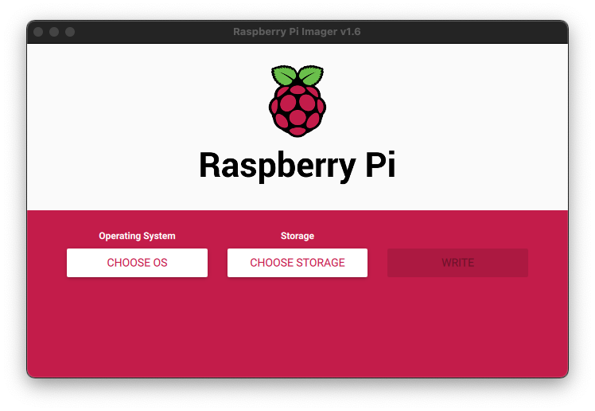

- Choose Raspberry Pi Os (32-bit) as the operating system. 
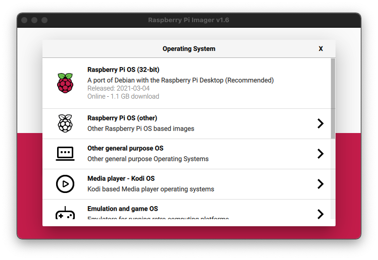

- Choose your micro SD card as the storage device.
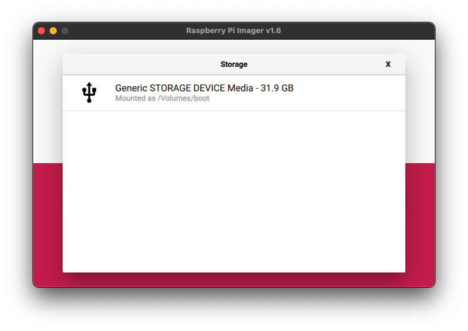

- Click "WRITE".

- Open new terminal at the boot drive (mounted micro SD after write). 
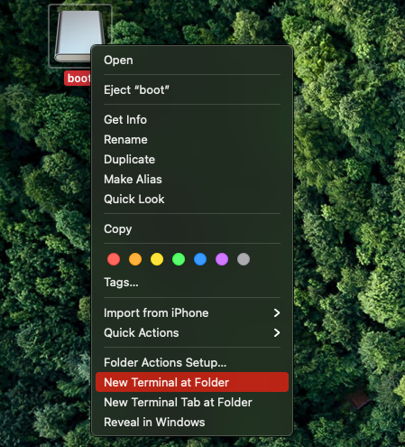

- Type the following command in the terminal and press enter. This creates an SSH directory in the boot drive and enables SSH-ing for the Raspberry Pi. 
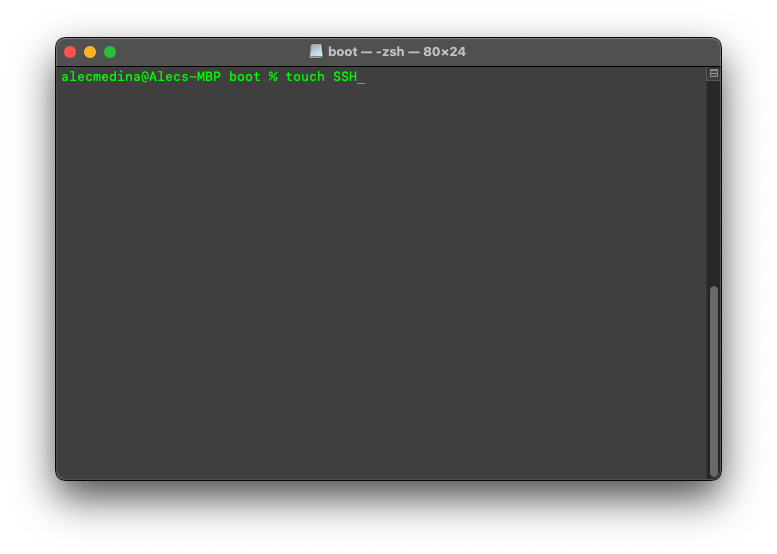

- Insert your micro SD card into your Raspberry Pi and connect your Pi (highlighted in green below) to power and to your router via ethernet.
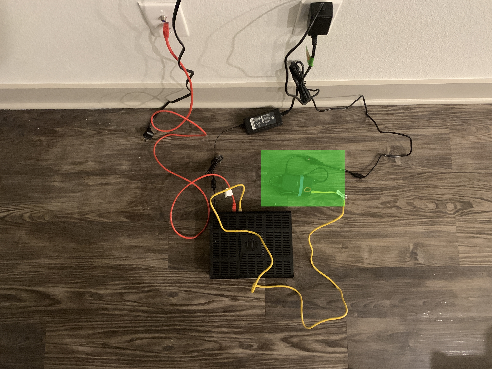

- Type the following command in a new terminal and press enter. This will create an SSH session with the Raspberry Pi.
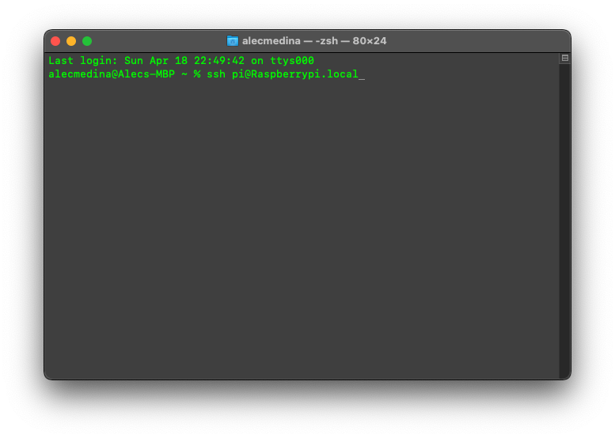

- If asked "Are you sure you want to continue connecting (yes/no)?" type "yes" and press enter.

- When prompted for pi@raspberrypi.local's password type "raspberry" and press enter.

NOTE: We have now SSH'd into the Raspberry Pi.

- Type the following command in the terminal and press enter. This will open a file where we can set our static IP address for Raspberry Pi.
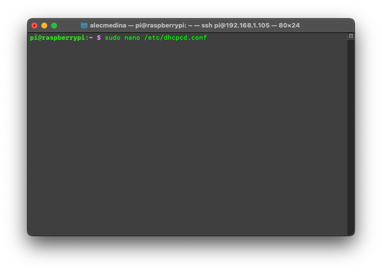

- Delete the lines between "# Example static IP configuration:" and "# It is possible to fall back to a static IP if DHCP fails:" and replace it with the following shown below. Here you should replace '192.168.1.254' with your router's IP and also replace the first three octets of '192.168.1.105/24' with the first three octets of your router's IP. 
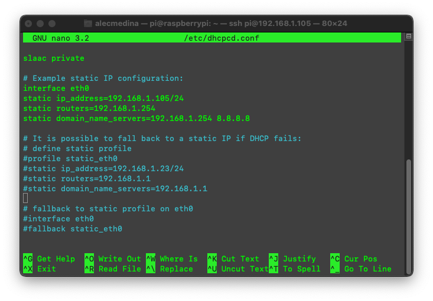

- After these changes have been made press control+O then enter to write to the file, then control+X to exit from the file.

- Type the following command in the terminal and press enter. This will reboot the Raspberry Pi with the new network setup. 
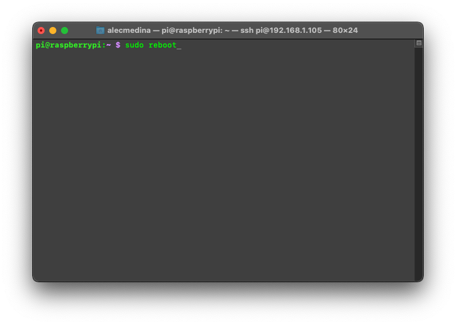

- Type the following command in the terminal and press enter. This will SSH into the Raspberry Pi again using the new static IP address. Here, you should use the static IP you set in the previous step.
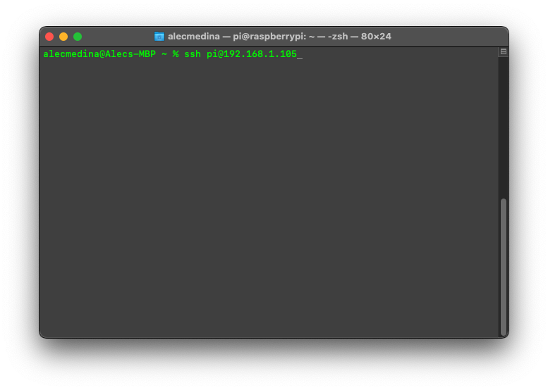

- If asked "Are you sure you want to continue connecting (yes/no)?" type "yes" and press enter.

- When prompted for pi@192.168.1.105's password type "raspberry" and press enter.

- Type the following command in the terminal and press enter. This will list all storage devices connected to the raspberry pi (including RAM so do not be alarmed if the list is lengthy).
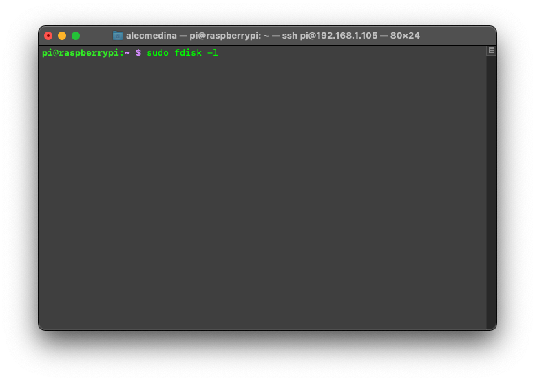

- If you scroll through you should see a disk named /dev/sda. This means 'storage device a'. If this is not your storage device's name, look for something similar. I know that my external SSD is 250 GB, as we can see this is close to the storage capacity of /dev/sda. This is another way to verify you are using the correct storage device. Near the bottom we see /dev/sda1, this is a partition on the drive. You may have more. We need to delete any partitions before continuing. 
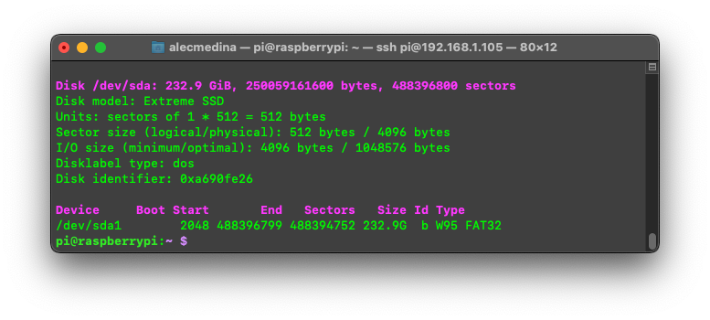

- Type the following commands in the terminal. This will delete the partitions on /dev/sda. If your drive is named something different you should use that name. If you have multiple partitions you should do the the last two lines for each partition. No terminal screen shots are provided as I do not want to erase the data off my drive.

```
pi@raspberrypi:~ $ sudo fdisk /dev/sda
Command (m for help): d
Partition number (1,2, default 2): 1
```

- Type the following commands in the terminal. This will create a new partition on /dev/sda. Note when presented with the second, third and fourth lines, just press enter, the terminal will use the defaults.

```
Command (m for help): n
Partition number (1-128. default 1):
First sector (34-976773134. default 65535):
Last sector. +/-sectors or +/-size{K,M,F,T,P} (65535*976773134. default 976766):

Created a new partition 1 of type 'Linux filesystem' and of size 232.9 GiB.

Command (m for help): w
```

- Type the following command in the terminal and press enter. This will format the drive partition we just created to ext4, a common linux file system type.

```
sudo mkfs -t ext4 /dev/sda1
```

- Type the following commands in the terminal and press enter. This will mount the drive partition to a directory named volume.

```
sudo mkdir /volume
sudo mount /dev/sda1 /volume/
```

- Type the following commands in the terminal and press enter. This will give everyone read/write access to the directory the drive partition is mounted to.

```
cd volume/
sudo chmod 777 -R .
```

- Type the following commands in the terminal and press enter. 
